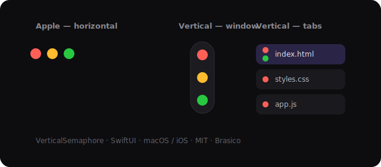

# VerticalSemaphore

**Apple's traffic lights — stood up vertically.** A tiny SwiftUI control for
custom window chrome and tab strips, with the native macOS lights auto-hidden
and revealed on hover.

[](https://github.com/brasico/VerticalSemaphore/actions/workflows/ci.yml)
[](LICENSE)



> The motif from [BRACOPED](https://brasico.ai) (Brasico). Apple's close /
> minimize / zoom cluster is horizontal — great for a titlebar, wrong for a
> narrow side-rail or a tall tab. So we stacked it. Open-sourced, MIT.

---

## Why vertical?

The horizontal traffic light assumes a titlebar. Modern app shells don't always
have one:
- a **floating side-rail** (vertical space, no horizontal room),
- a **tab** that needs its own close/detach affordance without a wide cluster,
- a chromeless, edge-to-edge canvas.

A vertical semaphore fits all three, keeps the familiar Apple color language
(red/yellow/green), and frees the top-left for the *real* OS lights on demand.

## Install (Swift Package Manager)

```swift
// Package.swift
.package(url: "https://github.com/brasico/VerticalSemaphore.git", from: "0.1.0")
```
Or in Xcode: **File ▸ Add Package Dependencies…** and paste the URL.

```swift
import VerticalSemaphore
```

Requires macOS 12+ / iOS 15+. The control itself is cross-platform; the native
window auto-hide effect (`WindowChrome`) is macOS-only.

## Package status

- Version: `0.1.0`
- License: MIT
- Tests: `swift test`
- CI: GitHub Actions on macOS
- Public API surface: `VerticalSemaphore`, `SemaphoreStyle`, and macOS-only
  `WindowChromeController`

## Use it on a window

A floating vertical semaphore on a side-rail, with the native lights auto-hidden
and revealed when the cursor enters the top-left corner:

```swift
struct RootView: View {
    @StateObject private var chrome = WindowChromeController()

    var body: some View {
        HStack(spacing: 0) {
            MyContent()
            VerticalSemaphore(
                onClose:    { NSApp.keyWindow?.performClose(nil) },
                onMinimize: { NSApp.keyWindow?.performMiniaturize(nil) },
                onZoom:     { NSApp.keyWindow?.performZoom(nil) },
                style: .window
            )
            .frame(width: 48)
        }
        .verticalSemaphoreWindow(chrome)   // hide native lights + reveal on hover
    }
}
```

## Use it on tabs

A tab usually just closes → give it one red dot. Tabs that can detach into their
own window get a green dot too:

```swift
HStack(spacing: 6) {
    TabChip(title: "index.html", isActive: true,
            onClose: { close("index.html") },
            onDetach: { popOut("index.html") })   // green dot
    TabChip(title: "styles.css", onClose: { close("styles.css") })   // red only
}

// inside TabChip:
VerticalSemaphore(onClose: onClose, onZoom: onDetach, style: .tab)
```

Pass `nil` (or omit) any handler and that dot renders dimmed and non-interactive
— so the control always shows the right number of affordances.

## How the window effect works (and the bug it avoids)

`WindowChromeController`:
1. On attach, hides the three native window buttons and makes the titlebar
   transparent + full-size content (edge-to-edge canvas).
2. A **raw `NSEvent` mouse monitor** watches the cursor vs. the window's
   top-left corner. Inside the corner → reveal the native lights; outside → hide.
3. Your content retracts ~26pt while they're shown so nothing overlaps.

**Why a raw monitor instead of a SwiftUI `.onHover` region?** Revealing the
lights shifts the layout. If the hover sensor lived *inside* that layout, the
reveal would move the sensor out from under the cursor → it hides → relayout →
re-reveal: an infinite flicker. Driving the decision off the **raw cursor
position vs. the fixed window corner** decouples sensing from layout and kills
the oscillation. (We hit this in production; this is the fix.)

Keep `cornerWidth` inside whatever gutter your custom chrome reserves, so the
reveal only fires over empty space — never over a tab's close control.

## Customization

```swift
VerticalSemaphore(
    onClose: { ... },
    style: SemaphoreStyle(
        closeColor: .red, minimizeColor: .yellow, zoomColor: .green,
        dotSize: 12, spacing: 8, hitPadding: 5,
        showsCapsule: true,        // frosted floating capsule
        showsGlyphsOnHover: true,  // ×, −, + on hover (Apple-style)
        glow: true                 // soft glow under the hovered dot
    )
)
```
Presets: `.window` (capsule + glyphs + glow) and `.tab` (compact, glyph-less).

## Development

```sh
swift build
swift test
```

See [CONTRIBUTING.md](CONTRIBUTING.md), [CHANGELOG.md](CHANGELOG.md), and
[SECURITY.md](SECURITY.md) for project policy, release notes, and reporting.

## License

MIT © Brasico. Contributions welcome.
